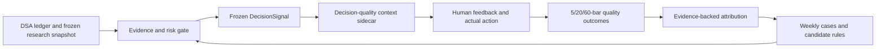

# Portfolio Decision Quality And Learning Loop Design

## Status

- Design approved in discussion on 2026-07-25.
- This document is a design artifact, not an implementation claim.
- The current DSA architecture remains `PROVISIONAL`; no improvement claim is valid before prospective evidence matures.

## Goal

Improve the quality of decisions for existing holdings, with balanced risk-adjusted return as the primary objective. The system should also help the user learn from real decisions by preserving what was known at the time, comparing AI and human judgment, attributing errors, and extracting user-approved personal rules.

The first release does not optimize stock discovery or automatic execution. It focuses on:

- current-position actions: `HOLD`, `REDUCE`, `EXIT`;
- incremental-capital actions: `ADD_IN_BATCHES`, `WAIT`, `NO_ADD`;
- 5-bar risk/timing review, 20-bar swing evaluation, and 60-bar thesis evaluation;
- daily quiet scans plus a weekly deep review;
- human confirmation after seeing the AI recommendation.

## Non-Goals

- No broker integration, order creation, automatic sizing, scheduler, or live runner.
- No second holdings ledger outside DSA.
- No guarantee of higher future returns.
- No daily full multi-agent fan-out.
- No automatic mutation of the saved portfolio risk policy.
- No automatic promotion of a statistical pattern into a personal rule.
- No long-term accuracy claim before 60 forward trading bars exist.

## Definition Of A Better Decision

The evaluation unit is a frozen portfolio decision event, not a whole Markdown report and not a generic bullish/bearish label.

```text
held position + frozen evidence
-> position action + incremental action
-> confidence, observable triggers, invalidation, next review
-> human accept/modify/veto/no-action decision
-> actual manual action
-> 5/20/60-bar outcomes
```

Evaluation follows three ordered layers.

### 1. Hard Evidence And Risk Gates

Instrument identity, product structure, position truth, price freshness, FX, risk policy, trading units, premium/parity evidence, and event evidence are blockers where applicable. A blocker cannot be offset by a weighted score or by a lucky later price move.

When critical evidence is incomplete, the decision must degrade to `WAIT` or `INSUFFICIENT_EVIDENCE`. The system must not fabricate benchmark returns, exposure changes, or trade quantities.

### 2. Decision Value

The primary evaluation is the value of the decision after risk and opportunity cost, not raw direction accuracy. Where the evidence contract supports the calculation, record:

- instrument return;
- benchmark return fixed at recommendation time;
- excess return;
- maximum favorable excursion (MFE);
- maximum adverse excursion (MAE);
- drawdown impact;
- action value versus a passive `HOLD` counterfactual;
- AI recommendation, human decision, and actual action comparison.

If exposure size, execution price, benchmark identity, or forward bars are unavailable, the affected metric is `unable`; it must not be estimated from cost basis or a generic market index.

### 3. Forecast And Confidence Diagnostics

Direction and confidence remain diagnostic metrics. Confidence should be checked by probability buckets and segmented by market, product type, evidence quality, horizon, and regime. A single global win rate must not hide weak subgroups.

The horizons have distinct meanings:

- 5 bars: short-term risk and timing;
- 20 bars: primary swing decision outcome;
- 60 bars: longer-term thesis validation.

## Daily And Weekly Workflow

### Daily Quiet Scan

1. Freeze the DSA portfolio research snapshot.
2. Apply identity, freshness, product, risk-budget, and evidence gates.
3. Suppress unchanged quiet holdings from expanded output.
4. Expand only material changes, threshold proximity, new evidence, expiring evidence, or unresolved high-impact disagreement.
5. Show the two action axes separately.
6. Ask the user to `ACCEPT`, `MODIFY`, `VETO`, or choose `NO_ACTION` after reading the AI recommendation.
7. Freeze the original AI recommendation before accepting feedback.
8. Record the actual manual action separately; never place an order.

An expanded holding should fit in one primary view and show:

- current conclusion and confidence;
- supporting and opposing evidence;
- benchmark, valuation, and portfolio-risk effects;
- observable add/reduce/exit triggers;
- thesis invalidation;
- next review point;
- missing or stale evidence.

### Weekly Deep Review

The weekly review summarizes:

- triggers that fired or expired;
- theses strengthened or invalidated;
- important AI-human disagreements;
- largest avoidable error and opportunity cost;
- repeated error categories;
- one action-changing research gap, if any.

Only a specific gap that could change the action may be offered to an external research capability. The user must confirm that expansion. Multi-agent agreement is not treated as independent evidence.

## Learning Loop

Each mature 5/20/60-bar review receives an evidence-backed attribution from this controlled taxonomy:

- `fact_error`;
- `evidence_error`;
- `thesis_error`;
- `valuation_error`;
- `timing_error`;
- `risk_error`;
- `execution_error`;
- `unattributed`.

The attribution must preserve contrary evidence and may remain `unattributed`. It is not an LLM excuse field.

Each weekly case card answers:

1. What was known and unknown at decision time?
2. Why did the AI make its recommendation?
3. Why did the user accept, modify, veto, or take no action?
4. What happened afterward?
5. Which evidence was most predictive?
6. Which decision stage failed?
7. What should be checked next time?

Personal learning has three outputs:

- demonstrated strengths where human overrides outperform the AI;
- repeated biases or execution mistakes;
- candidate personal rules with sample size, counterexamples, and applicability.

Candidate rules remain observational until the user explicitly approves them. Small samples never change future scoring or risk policy automatically.

## Architecture



### Existing Sources Of Truth

- DSA ledger/replay remains the only holdings, cash, and transaction truth.
- Instrument registry remains the identity, product, currency, and trading-unit truth.
- Portfolio risk policy remains the only saved risk-budget truth.
- `DecisionSignal` remains the immutable AI recommendation asset.
- Existing shadow feedback remains the AI-human decision record.
- Existing direction outcomes remain backward compatible.

### New Sidecars

Do not overload `DecisionSignal.action` or replace the existing direction outcome engine. Add isolated sidecars for:

1. Decision context: account, frozen snapshot hash, frozen instrument type, position action, incremental action, benchmark fixed at recommendation time, confidence payload, and material-event fingerprint.
2. Quality outcome: benchmark/excess return, MFE, MAE, counterfactual status, and explicit unable reasons for 5/20/60 bars.
3. Attribution: horizon, error category, evidence, proposed/confirmed/rejected state, and user note.

The sidecars should reference the signal identifier without becoming a second holdings ledger. New tables are preferred over destructive alteration of the existing signal table. Any schema and API contract implementation still requires explicit confirmation under repository rules.

## Benchmark And Counterfactual Rules

- Benchmark identity and evidence are frozen at recommendation time.
- Ordinary equities use a declared market or sector benchmark only when that mapping is evidenced.
- ETFs use their verified tracked index or declared product benchmark.
- Daily-reset leveraged products use product-specific evaluation and must not be ranked as ordinary long-term holdings.
- Missing benchmark evidence leaves excess-return metrics unavailable.
- A true portfolio-return counterfactual requires known exposure and execution data from DSA.
- `REDUCE` without a quantity/exposure contract and `ADD_IN_BATCHES` without a triggered tranche cannot receive fabricated return impact.

The first quality engine may publish price-path and benchmark metrics while leaving unavailable decision-value fields null. A later phase may use linked DSA ledger events to calculate actual portfolio impact.

## Deduplication

Repeated daily scans do not create independent samples when the decision is materially unchanged. A material-event fingerprint should include, at minimum:

- account and instrument identity;
- frozen snapshot hash or relevant snapshot subset;
- both action axes;
- evidence version/cutoff;
- trigger and invalidation contract;
- benchmark identity;
- decision profile/version.

An unchanged event may refresh display state but must not inflate accuracy, calibration, or learning sample counts.

## Failure Handling

- Missing identity, current price, required product evidence, or risk policy fails closed.
- If account/instrument identity, snapshot hash, both action axes, or cutoff is missing, keep the explicit blocker on the signal and do not persist a partial sidecar that cannot have a stable material-event identity.
- Missing benchmark, forward bars, or exposure produces metric-level `unable`, not a fake zero.
- Outcome and learning failures do not mutate the ledger or original signal.
- Sidecar write failures stay visible and do not block the existing report-save path.
- Future data leakage, benchmark replacement after the cutoff, or immutable-context mutation is a hard validation failure.
- External capability failure keeps the result preliminary; it does not trigger fan-out.

## Prospective Validation

### Phase 0: Freeze Baseline

Record the current DSA recommendation and evaluation behavior before changing decision logic. Do not reinterpret the baseline with future rules.

### Phase 1: Shadow Operation

Run the new decision-quality loop without changing risk budgets or executing trades. Verify at least 20 trading days of operational integrity. This is not enough for a long-term return claim.

### Phase 2: Limited Adoption

Adopt a candidate rule only when comparable prospective samples show no new hard-gate failures and improve decision value without relying on materially larger drawdown. The user still approves personal rules.

The evaluation panel reports:

- decision value versus `HOLD` and the frozen benchmark where computable;
- MFE, MAE, and drawdown;
- 5/20/60-bar direction and calibration;
- action coverage and abstention quality;
- human override value;
- repeated-error rate and correction time;
- sample size, concentration, and unable reasons.

No swing improvement claim is made before 20-bar outcomes mature. No longer-term improvement claim is made before 60-bar outcomes mature. Highly correlated repeated signals or samples dominated by one instrument remain descriptive only.

## Verification Strategy

- Unit tests for action axes, material-event fingerprints, horizon selection, and fail-closed behavior.
- Storage tests for new-table creation, unique keys, immutability, and non-destructive initialization.
- Deterministic outcome tests for benchmark return, excess return, MFE, MAE, corporate actions, missing bars, and no-lookahead boundaries.
- API tests for context freeze, human feedback, quality outcomes, attribution confirmation, and error contracts.
- Web tests for quiet/expanded states, two-axis actions, feedback, unavailable metrics, and weekly cases.
- Integration tests proving sidecar failure cannot mutate or block the portfolio ledger.
- Full backend gate plus Web lint/build before implementation is considered complete.

## Rollback

Stop creating or displaying new decision-quality sidecars and revert the new code paths. Existing portfolio data, risk policy, `DecisionSignal`, feedback, and historical sidecar rows remain intact. Data deletion is a separate, explicitly authorized operation.
