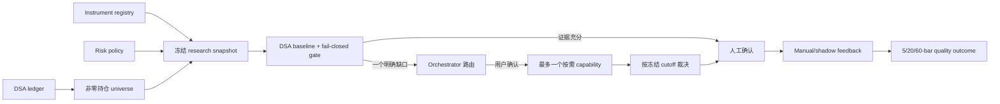

# DSA 组合研究控制面

当前架构状态为 `PROVISIONAL`。DSA 是唯一可写的持仓与风险控制面；外部研究能力只接收冻结、脱敏的 artifact，并停在人工确认，不具备交易权限。该架构至少完成 20 个交易日的前瞻 shadow 记录后才能重新评估，不能用历史回测收益、LLM 自评或多 Agent 一致意见替代。

## 当前个人美股研究重心

自 2026-07-23 起，美股组合采用“指数核心 + 少量高潜力个股”的研究框架：

1. 纳斯达克 100 与标普 500 指数 ETF 是美股长期核心暴露，两类指数资产合计应构成美股组合的最大部分。当前已确认的纳斯达克 100 产品为 `QQQM`；标普 500 产品必须在 instrument identity、费率、流动性、跟踪误差和交易单位核验后再确定，不能由 Agent 自动代选。
2. 个股只作为卫星增强层，数量保持少而精。候选必须同时检查可验证的增长空间、相对自身历史和同行的估值、现金流与资产负债表、未来 6 至 18 个月催化剂、thesis 失效条件，以及与指数核心的重复暴露。
3. 已经是纳斯达克 100 或标普 500 重要成分的个股，只有在额外超配理由明确且可验证时才单独保留；公司质量高不等于当前估值低，也不自动构成超配理由。
4. 每日重置杠杆 ETF、单股杠杆 ETF 和其他路径依赖产品不进入长期核心或长期卫星层。此类产品统一进入 `RISK_ONLY` 池，默认目标是风险退出或短期事件管理，不得因浮亏转化为无限期长期持有。
5. 日常复盘先检查指数核心是否仍占主导，再检查个股数量、单股集中度、行业和因子重复、估值变化及新事件。安静且 thesis 无变化的持仓合并为简短 `HOLD/WAIT`；只有接近风险门槛、基本面变化或出现可验证机会的标的才展开分析。

本节只定义研究排序和组合结构，不是目标仓位或交易授权。具体 ETF、配置比例、调仓数量和风险阈值必须由 DSA 的 instrument registry、现金、完整 risk policy、交易单位和人工确认共同决定；`risk_budget_evaluated=false` 时禁止采用 Agent 生成的仓位百分比。

## 高潜力股发现与验证

“寻找下一个美光、闪迪或英伟达”只定义目标画像：在结构性需求扩张中，找到尚未被充分定价、能把产业链约束转化为收入、利润和现金流的公司。它不是历史类比、收益承诺或放宽风险门槛的理由；不能因为一家公司处于相似赛道、被社媒频繁提及，或过去出现过同类十倍股，就推断它会复制历史收益。

高潜力股研究分为 `DISCOVERY` 和 `ACTION` 两层，二者必须隔离：

1. `DISCOVERY` 从已经可观察的需求冲击开始，例如真实采购、订单或 backlog、价格与交期变化、产能预订、客户采用、资本开支或监管/技术迁移；只有叙事而没有需求证据的主题只进入线索池。
2. 先画产业链，再排公司。至少区分终端需求、系统/OEM、模块、芯片与关键部件、制造/封装/测试、设备、材料耗材和物理基础设施，避免从热门 ticker 反推故事。
3. 优先寻找真正难扩的稀缺层：供应商少、认证周期长、替代成本高、扩产受设备/许可/纯度/良率/技术诀窍约束，且客户无法轻易绕开。受益于趋势不等于控制瓶颈。
4. 将稀缺层映射到公司的具体业务和财务报表，核验相关收入占比、订单或客户证据、产能与利用率、ASP/毛利率、库存与应收、资本开支、自由现金流、资产负债表和潜在稀释。无法说明需求如何进入财务数字的候选不得升为高优先级。
5. 检查预期差而不是只看 TAM 或低市值：比较公司自身历史、可比公司和市场隐含预期，区分低估值、周期高点利润、价值陷阱和已经计价的高增长。小市值和业务纯度可以提高弹性，也同时提高流动性、融资、客户集中和执行风险。
6. 为每个候选写明未来 6 至 18 个月催化剂、未来 1 至 4 个季度的验证指标，以及可证伪条件。替代供应商认证加快、扩产快于需求、订单不转收入、毛利与现金流不兑现、客户流失、融资稀释或估值提前透支，都应触发降级或移出候选池。
7. `ACTION` 层必须重新通过 DSA 的持仓、instrument identity、实时行情与时区、市场状态、现金、风险预算、交易单位、指数重复暴露、行业/币种/高 beta 集中度和事件风险检查。发现层评分不得绕过任何 blocker，也不能自动生成 `ADD_IN_BATCHES`。
8. 入场只写可观察条件和失效条件，不因单日大涨、社媒热度或技术突破直接追价。若关键一手证据、当前估值或同 cutoff 行情缺失，动作降级为 `WAIT` 或 `INSUFFICIENT_EVIDENCE`。

证据按强弱分层：监管/交易所文件、公司公告与财报、电话会、官方订单/项目/认证和技术标准优先；可信行业媒体、产业链上下游公开交叉验证用于补充；社媒帖子、KOL 线程、模型评分、价格异动和开源仓库内容只用于生成线索。同源转载、共享底层数据或同一模型产生的多条结论视为相关证据，不进行多数投票。

每轮可以在内部建立更广的产业链候选集，但对用户只输出最多 3 个“优先研究候选”，并逐一给出精确标的与产品类型、是否持有、需求证据、稀缺层位置、财务传导、估值缺口、催化剂、验证指标、失效条件、组合重复暴露和证据时效。未通过验证的公司留在线索池，不用长名单制造确定性。

默认仍只运行“DSA baseline + Orchestrator 风险裁决”。发现高潜力线索不构成启动 Vibe、TradingAgents、确定性技术代理或其他 worker 的授权；只有一个明确缺口可能改变 `WAIT/HOLD/ADD_IN_BATCHES/REDUCE/EXIT` 结论时，才能提出一次最小扩展申请并等待确认。历史命中、自报收益、回测、仓库 star、LLM 自评或多 Agent 一致意见都不是未来收益证据；候选质量必须用冻结 thesis、后续一手证据和前瞻结果持续检验。

## 单一真源

| 状态 | 唯一真源 | 其他系统边界 |
| --- | --- | --- |
| 交易、现金、公司行动 | DSA ledger | 不从报告或 worker 反推 |
| 数量、成本、现金、组合估值 | DSA replay/cache | 外部 worker 不接收数据库路径 |
| 标的身份、币种、产品结构、交易单位 | `portfolio_instruments` | provider 不能自动标记为 verified |
| 组合风险预算 | singleton `portfolio_risk_policy` | 环境变量阈值仅兼容旧告警 |
| 建议、人工判断、实际动作、后验结果 | `decision_signals` sidecar | 不自动下单，不写 broker mandate |

`Vibe-Trading` 只用于已确认的时机、当前事件、官方产品条款和复杂产品证据；`TradingAgents` 只用于普通公司逻辑、多空论证和重大风险第二意见；Orchestrator 只做路由与证据裁决。`ai_sentiney` 不进入日常主线。

## 时间资格与冻结输入

`portfolio-research-snapshot-v1` 当前只支持 `point_in_time.scope=current_prospective`。它可以证明当前预检输入被冻结并参与 `snapshot_hash`，但不能从会原地更新或删除的 ledger/cache、instrument registry、risk policy 和 DecisionSignal 反推出历史状态，因此 `historical_replay_eligible` 固定为 `false`。传入过去 cutoff 只会得到来源截止时间和精确 blocker，不构成历史 replay。

`point_in_time.source_cutoffs` 分别报告 `accounts`、`position_cache`、`daily_snapshots`、`instrument_registry`、`risk_policy` 和 `decision_signals` 的最大可见变更时间；有记录但缺少时间戳、记录晚于请求 cutoff，或 active DecisionSignal 捕获被上限截断时，`prospective_decision_eligible=false`。对应稳定 blocker 同时进入 `point_in_time.blockers` 和 `hard_blockers(scope=point_in_time)`，`completeness` 保持 `INSUFFICIENT_EVIDENCE`。

当前持仓 identity 对应的 active DecisionSignal 会以 baseline 所需的公开字段和脱敏结构化决策冻结到 `decision_signals`，并参与 snapshot hash。生产 baseline 只消费这组冻结 signal，不在 preflight 后查询当前 signal；snapshot 中缺失的 signal 按 `active_decision_signal_missing` 处理，不能用较新的数据库状态补齐。

绑定 snapshot 的 `POST /api/v1/portfolio/research-baseline` 和 `POST /api/v1/portfolio/positions/{symbol}/analysis` 先比较 hash，再检查 `prospective_decision_eligible`。hash 漂移返回 `409 research_snapshot_mismatch`；hash 匹配但时间资格不成立返回 `409 research_snapshot_not_point_in_time_eligible`，且不会构建 baseline 或提交分析任务。Phase 1A 不改变未携带 snapshot binding 的 legacy 手工分析入口；该入口不具备本节的冻结输入保证，不能作为受支持的每日全持仓决策流程。

现有 portfolio account、position cache 和 daily snapshot 的旧写入列使用 host-local naive 时间，instrument、risk policy 和 DecisionSignal 使用 UTC-naive 时间。资格计算按来源在边界归一化为 UTC，不改写数据库；若数据库文件跨时区迁移，旧行缺少原始时区身份，必须重新生成当前 cache/snapshot 或保持 fail closed，不能据此宣称历史可重放。

## 初始化顺序

1. 在 DSA ledger 录入账户、交易、现金与公司行动，确认非零持仓可由 replay 得到。
2. 在持仓页登记每个实际持仓的 instrument identity；`verified` 必须有证据来源和时间。`evidence_as_of` 必须包含显式时区偏移，服务统一按 UTC 保存和返回；Web 的 `datetime-local` 只负责本地时间录入与展示。
3. 人工保存完整的组合风险预算。系统不会静默插入默认预算。
4. 将本机 `ANALYSIS_UNIVERSE_SOURCE=portfolio_holdings`。该模式读取失败或空持仓时不会回退到 `STOCK_LIST`。
5. 调用 `GET /api/v1/portfolio/research-snapshot` 检查 `snapshot_hash`、`point_in_time`、`decision_signals`、`hard_blockers`、`completeness`、`risk_budget`、`benchmarks` 与 `analysis_runtime`。只有 `prospective_decision_eligible=true` 才能进入绑定 POST；`historical_replay_eligible=false` 不得被解释为历史 replay。若组合包含每日重置产品，只有 `architecture=single` 且 `automatic_multi_agent=false` 才能提交 baseline；`multi` 或缺失证明均必须在 POST 前停止。GET 不补写风险快照。
6. 对每个持仓调用 `POST /api/v1/portfolio/positions/{symbol}/analysis` 时同时提交 preflight 返回的 `research_snapshot_hash` 与 `research_cutoff`。DSA 会先重建并核对 hash；任何漂移都返回 `research_snapshot_mismatch`，要求重新 preflight，不会静默改用较新的组合状态。

绑定冻结快照的 POST 在解析持仓上下文时是只读路径：不得刷新实时行情，也不得持久化新的 portfolio snapshot。行情缓存刷新只能发生在 preflight 之前或分析任务内部，并且不能改变后续账户持仓行继续使用同一 hash/cutoff 的能力；相关回归测试必须连续提交至少两行并核对两次均接受同一冻结身份。

全持仓 runner 的 `--timeout` 表示连续无后端状态/进度变化的最长时间，不是整轮 wall-clock 上限。manifest 分别记录后端 `observed_status`、真实 `terminal_status` 和本地 `acceptance_status`；本地 timeout 不能冒充 DSA terminal。只有全部 required task terminal、持仓行数对账且 `evidence_qualified=true` 时，`consolidated_ready` 才能为 true。

若 identity、价格、汇率、risk policy、QDII 溢价、ADR 换算、每日重置条款或交易单位证据不完整，可执行动作必须降级为 `alert`。

当前 risk policy 是唯一可写预算真源。Frozen snapshot 按账户原生 `base_currency` 分桶评估，同币种账户合并，A 股保持 CNY、美股保持 USD、港股保持 HKD，不把全组合强制换算为 CNY。每个币种桶独立检查现金缓冲、单一持仓、verified 行业暴露、每日重置/高风险产品敞口和历史最大回撤；行业证据来自 instrument registry 的 `portfolio-risk-v1` metadata，回撤只使用所有同币种 active account 都有记录且 `fx_stale=false` 的完整日期。

阈值被突破时 `risk_budget_evaluated=true`，并在 `breaches` 中列出真实超限；缺少当前现金/价格、verified 行业证据或至少两个完整回撤日期时才返回 `risk_budget_evaluated=false`，同时写入 `evidence_blockers` 和 `portfolio_risk_budget_thresholds_not_evaluated`。只有 evaluated 为 true 才能采用基于 DSA 风险预算的 sizing；evaluated 为 true 不代表没有 breach。

## 实际决策流



外部 capability 的状态只允许 `not_required`、`offered_pending_confirmation`、`declined_by_user`、`confirmed_running`、`completed`、`blocked` 或 `failed`。发现触发条件只允许提出 upgrade offer，不等于授权运行。

## 四条最小流程

### 日常复盘

普通用户看到的流程固定为：

```text
准备今日资料 -> 查看全部持仓建议 -> 选择需要深挖的持仓 -> 记录人的决定
             -> 等待 5/20/60 个交易日 -> 查看策略表现
```

1. 调用 `POST /api/v1/portfolio/research-evidence/prepare`，只为当前非零持仓准备行情、`000300/HSI/SPY` 基准和需要的汇率。该入口可以写入行情与汇率缓存，但不会修改持仓、现金、交易、风险政策、策略阶段或生成订单。同日 bar 不当作已收盘数据；已有同日缓存与本次来源或 OHLC/成交字段不一致时保留旧行，并把该标的标为“资料不足”。
2. 调用 `GET /api/v1/portfolio/research-snapshot` 冻结同一 cutoff 的持仓、账户、产品、风险、行情、基准和汇率。超过时效的价格、benchmark 或 FX 不能得到“已保存”。
3. 调用 `POST /api/v1/portfolio/research-baseline`，绑定同一 frozen snapshot，批量生成全部非零持仓的确定性 baseline；该阶段不再刷新行情/日线缓存，也不进入新闻或 LLM 分析。
4. 输出全部持仓，并把建议深挖项统一显示为 `名称（symbol）`。普通界面只显示“加仓、持有、减仓、清仓、资料不足”；内部原因码、hash 和双轴字段不直接展示。安静且资料完整的持仓只保留简单建议、失效条件和下次复核点。
5. 暂停并等待用户选择。只有选中的 `market:symbol` 才复用 `POST /api/v1/portfolio/positions/{symbol}/analysis` 运行完整新闻与 LLM；合法的非推荐持仓也允许人工选择。
6. baseline 与 deepened 证据分别保存；等待期间 snapshot hash 漂移时重新运行 baseline，不静默采用新持仓状态。单个标的资料不足只影响该标的，不阻断其他持仓。
7. 人工确认或修正，不触发订单。5/20/60 个交易日未成熟只表示继续等待，不算成功或失败；资料不足的建议不计入有效策略成绩。

### 首次真实模拟记录（2026-07-31）

首次真实运行覆盖 5 个账户、17 个非零持仓，持仓行数对账通过，且 API 证明执行架构为单 Agent、自动多 Agent 关闭。资料准备结果为 `ready=0`、`insufficient=17`，因此普通用户结论统一为“资料不足”，没有进入选股深挖、没有创建新的有效建议，也没有自动写入人的决定。

失败原因不是策略表现，而是输入证据未达到保存标准：所有持仓的已有日线与本次抓取窗口存在来源或数值冲突，A 股固定基准 `000300` 和港股固定基准 `HSI` 也未能按原身份取得。系统按约定保留旧行，不以 `000001`、其他指数或当前新闻补齐，也不把旧建议当成新样本。

稳定行情证据切片已在 2026-08-03 完成：三地 benchmark 已固定取数代码、来源版本和复权口径，持仓与 benchmark 复权不一致时禁止保存建议，绑定冻结 snapshot 的分析也不会改写行情缓存。

同日复跑仍为 `ready=0`、`insufficient=17`。17 条持仓均与旧缓存的重叠 bar 冲突，A 股和美股的固定 benchmark 也存在冲突；只有 `HSI` 成功新增 260 条显式 `adjusted` 行情。系统没有启动详细分析或保存新建议，持仓、现金、交易、风险规则、策略记录和人工反馈逐表不变。

下一步不再修改策略，而是把可评价行情从单版本运行缓存中分离为只追加的证据版本。这样同一日期的旧缓存和新来源版本可以并存，冻结建议只引用当时的精确证据，不依赖后来可能变化的“最新值”。只有资料完整的行才允许保存新建议并开始等待 5/20/60 个交易 bar。

选中标的进入详细分析后，同一任务已经取得的实时行情会作为预载 Agent 工具结果复用；Agent 新闻工具已持久化结果时，Pipeline 不再重复搜索。港股实时行情优先使用腾讯单票接口，东方财富和新浪全市场接口只在单票失败后回退。该优化不改变三路并发上限、证据门禁或失败降级语义。

### 单股深研

1. 先确认 tradable instrument、上市地、币种和是否为 ADR/ADS 或杠杆产品。
2. 普通公司 thesis/财报/重大 bear case 不清时，提出 TradingAgents 第二意见。
3. 当前事件或一手来源缺失时，改为提出 Vibe evidence；默认不同时运行两者。
4. 新证据只能补充论证，不能清除 DSA identity、freshness、risk 或 lot-size blocker。

### ETF / QDII 决策

1. 分开记录产品、底层指数/资产、报价币种、NAV/IOPV、费率、交易单位和溢价时间。
2. QDII 缺少同 cutoff 的 premium/discount 证据时，`buy/add` 必须为 `alert` 或 `WAIT`。
3. 当前官方条款或事件证据缺失时，只提出 Vibe product evidence。
4. 不把 ETF/QDII 与底层普通证券的历史收益直接混排。

### 重大风险复核

1. 由 DSA 先识别集中度、回撤、产品结构、重大事件或 `REDUCE/EXIT` 候选。
2. 普通公司重大 thesis 风险可提出 TradingAgents；产品条款、ADR parity、每日重置或事件证据可提出 Vibe。
3. required worker 失败时结论保持 `PRELIMINARY` 或 `INSUFFICIENT_EVIDENCE`，不能事后改成 optional。
4. 最终减仓/退出仍由人工确认，并记录实际动作与修正时间。

## 前瞻反馈与学习闭环

持仓建议必须分成两个互不替代的轴：现有暴露使用 `position_action=hold|reduce|exit`，新增资金使用 `incremental_action=add_in_batches|wait|no_add`。人工反馈使用 `accept|modify|veto|no_action`：接受沿用冻结双轴，修改必须明确提交两个人工轴，否决必须给出原因，暂不行动不计为 agreement。人工反馈和实际动作只能追加到 sidecar，不能改写 AI 原始建议或冻结上下文。

已有决策质量上下文时，服务端从冻结记录取得 snapshot hash 和 context reference；首次反馈可以不评价 usefulness。旧库内部用 `unrated` 兼容 `NOT NULL`，API 对外返回 `null`。没有质量上下文的 legacy 信号仍按旧 contract 要求首次同时提交真实 `useful|not_useful`、snapshot hash、证据来源、实际动作、修正分钟数、延迟和 token。

`POST /api/v1/decision-signals/quality/outcomes/run` 是质量闭环唯一显式 outcome 入口，没有 scheduler：

- `5d` 用于短期执行/时机观察；
- `20d` 是 shadow 设计的首个操作性评估门；
- `60d` 用于较长期 thesis 与决策价值证据。

结果要求决策日同日锚点、固定 benchmark、完全对齐的前瞻交易日和可识别且一致的复权标记；任一证据缺失时写明 `unable_reason`，不计算局部窗口。`reduce` 或 `add_in_batches` 没有冻结 exposure/tranche contract 时不能构造反事实仓位，保持 `exposure_contract_missing`。benchmark 只提供相对参照，不证明因果；收益、MFE、MAE 和事后持有反事实都不是自动交易依据。

每个 5/20/60 窗口可由人工提交 `proposed|confirmed|rejected` 归因。周复盘和候选模式只聚合 `confirmed` 归因，展示精确样本数、反例、单标的集中和重复事件警告；候选状态仅为 `observed`，不会自动激活规则、修改 Prompt/评分或写入风险策略。

shadow 开始前必须记录开始日期、质量引擎/决策/证据版本、eligible material-event 定义、固定 benchmark 规则、可识别的复权数据来源和全部缺失证据。至少连续运行 20 个交易日并等待对应 20-bar 窗口成熟后，才能决定继续、修正或否决当前流程；60-bar 未成熟前不能给出长期收益改善结论。所有表现结论保持 `PROVISIONAL`，不能在启动时或仅凭 5 日结果宣称收益率已经提升。

### Shadow 启动记录（2026-07-25）

- 启动日期：`2026-07-25`；质量引擎 `decision-quality-v1`，双轴决策 `portfolio-decision-v1`，冻结证据 `portfolio-research-snapshot-v1`。
- eligible material event：质量上下文必须为 `complete`，并具备账户/标的身份及冻结产品类型、冻结 snapshot hash、两个人工不可改写的 AI 决策轴、完整 5/20/60 置信度、固定 benchmark 身份、evidence cutoff/version、decision profile/version、失效条件和下次复查点。同一 material-event fingerprint 的重复展示只计一个样本；任一上述 recommendation-time 字段实质变化才形成新 event。
- 当前本地 smoke 的普通股和特殊产品样本均固定为 `us/SPY/market_index`，snapshot hash 在创建、接受反馈和拒绝改写后保持一致。该记录只证明冻结与只写 sidecar 的契约，不把 SPY 外推为其他市场的 benchmark，也不证明收益改善。
- 启动时 5/20/60 窗口均为 `pending` / `horizon_not_mature`，没有运行未成熟 outcome。20-bar 与 60-bar 的成熟日期以各标的及 benchmark 从决策 cutoff 后实际对齐的交易 bar 为准，当前不预填日历日期。
- 当前缺失/受限证据包括：历史日线的复权标记可能无法从既有 `StockDaily.data_source` 可靠识别；没有冻结 exposure/tranche contract 时不能评估 `reduce` / `add_in_batches` 的决策价值；冻结 sidecar 以 material fingerprint 覆盖 supporting/opposing evidence 和 trigger contract，但不单独持久化这些原始字段；产品类型会从同一冻结 snapshot 单独保存，旧 sidecar 行无法可靠回填时返回 `instrument_type_missing` 而不进入成熟学习样本；没有额外证据时周复盘的 triggered/expired conditions 为空。
- 所有表现、归因和候选规则结论继续为 `PROVISIONAL` / `observed`。20-bar 操作门和 60-bar 长期证据门成熟前，不得声称收益率已经提升。

## 失败与回滚

- ledger 读取失败或 holdings mode 为空：返回空/blocked，不回退 watchlist。
- point-in-time blocker 存在：绑定 POST 返回 `409 research_snapshot_not_point_in_time_eligible`，先修复来源时间证据并重新 preflight；不得降级为读取当前 signal 或历史推断。
- risk policy 未保存：禁止 sizing 和可执行 add/reduce。
- `risk_budget_evaluated=false`：当前现金/价格、行业或回撤证据不完整，任何 sizing 只能人工核对；根据 `evidence_blockers` 补证后重新生成 frozen snapshot。
- GET 风险历史不足：返回 `available=false` 和 `insufficient_snapshot_history`，不在 GET 中补写。
- 外部 worker 不安全、不可用或无 fresh artifact：fail closed，不启动替代 worker fan-out。
- 回滚日常 universe：把本机 `ANALYSIS_UNIVERSE_SOURCE` 改回 `watchlist`；不会删除 ledger、identity、risk policy 或历史 feedback。
- 回滚代码不会自动删除新增 nullable 列或前瞻记录；任何数据清理必须另行制定方案。

本流程不包含 broker API、自动下单、mandate、live runner、scheduler 或 shell-capable worker 授权。
